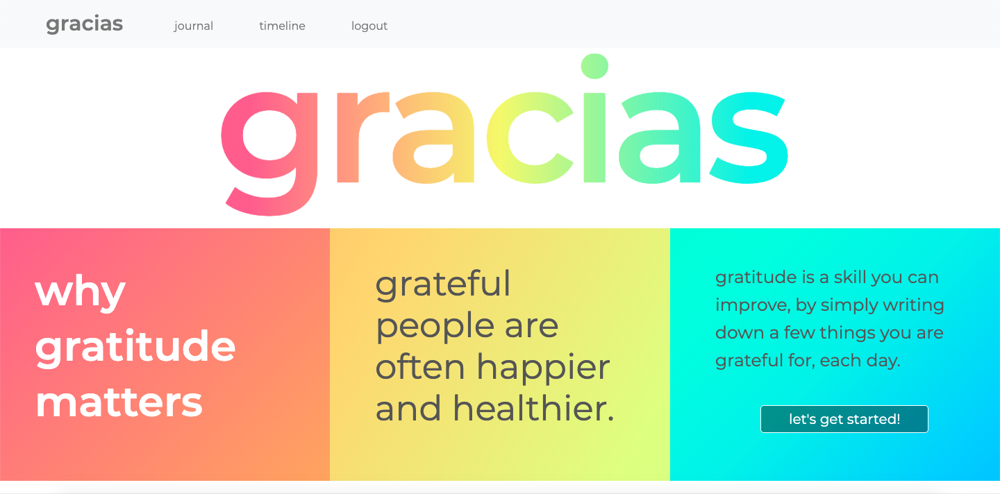

# Gracias 
## A gratitude app

I took the idea from hardcopy gratitude diaries. 
The concept is pretty basic but can have a powerful positive effect.
The simple habit of reflecting on what you’re grateful for can actually lead to a happier, more content life.
All it takes is a few moments of your time and a gratitude journal to record your thoughts.  
This app also has the added feature of writing down names of people who've had a positive effect on you,
and how you can show your appreciation towards them.

---

## Deployment
  - Heroku: https://gracias3.herokuapp.com/

---

## Features
  - Login/Sign Up page
  - Journal page, where you can submit your answers to each question of the app.
  - History page, where you can read, edit or delete your diary entries in a calendar format. 

---

## Used technologies:

### Front-end:
1) Ruby-on-Rails
2) HTML
3) CSS
4) Bootstrap

### Back-end:
1) Ruby-on-Rails controllers and models
2) PostgreSQL database.
---

### Screenshots
   

   